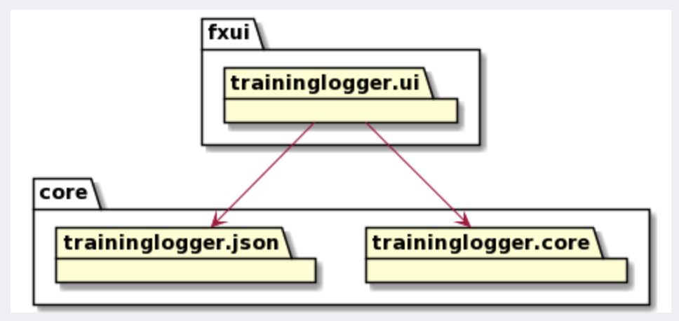
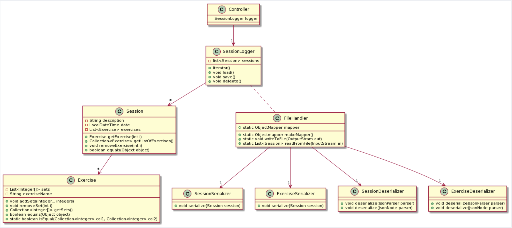
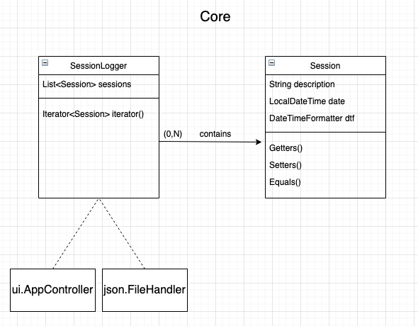
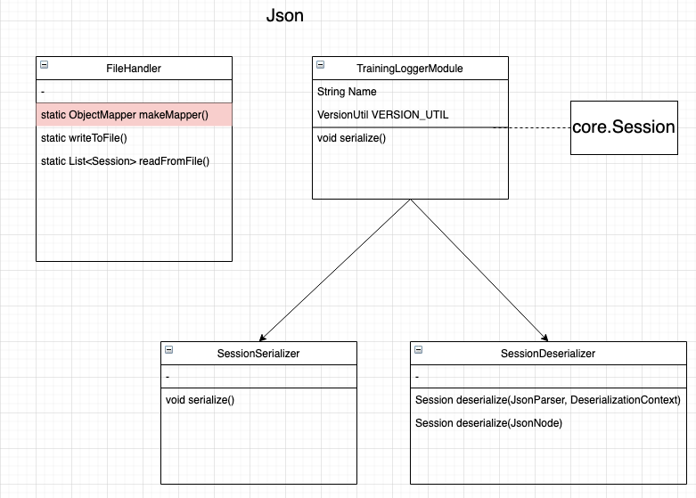
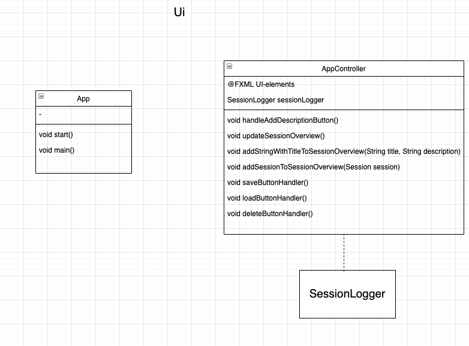
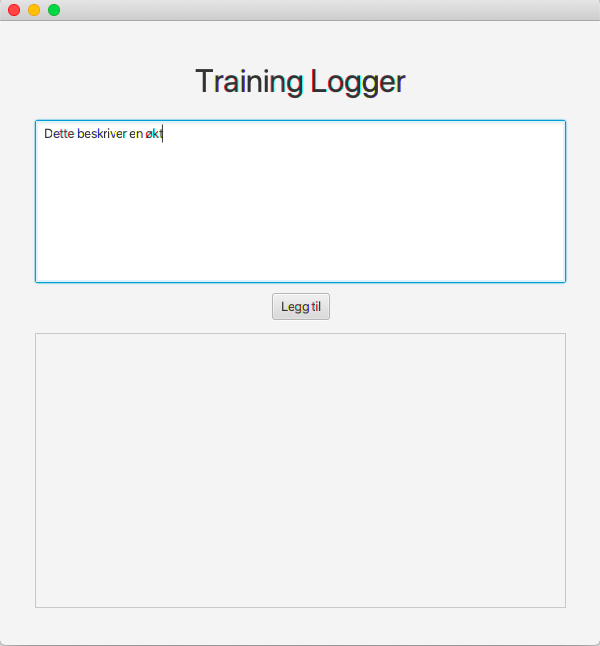

# Training Logger

Training Logger er en applikasjon som lar deg loggføre gjennomførte treninger i tillegg til å planlegge fremtidige treninger.

## Beskrivelse

```plantuml

Title Diagram av Core-modulen

class Session {
    - final DateTimeFormatter dateTimeFormatter 
    - final List<Exercise> exercises
    - String description 
    - LocalDateTime date
    
    + Session(String d, Exercise... e) 
    + void AddExercises(Exercise... e)
    + Iterator<Exercise> iterator()
}

class Exercise {
    - final List<Set> sets 
    - String name
    
    + Exercise(String name, Set... sets)
    + void AddSets(Set... sets)
    + Iterator<Set> iterator()
}

class Set {
    - final int repetitions
    - final double weight 
    
    + Set(int r, double w)
}

class SessionLogger {
    - final List<Session> sessions 
    - final Map<String, Double> records 
    
    + SessionLogger(List<Session> s, Map<String, Double> r)
    + void updateRecordWithSession(Session session)
    + void delateRecords() 
    + Iterator<Session> iterator()
    + void delateAll()
}

class TrainingLoggerModule {
    -static final String name
    +TrainingLoggerModule()
}

class SesssionLoggerSerializer {
    +void serialize()
}
class SessionSerializer {
    +void serialize()
}
class ExerciseSerializer {
    +void serialize()
}
class SetSerializer {
    +void serialize()
}
class SesssionLoggerDeserializer {
    + SessionLogger deserialize()
}
class SessionDeserializer {
    + Session deserialize()
}
class ExerciseDeserializer {
    + Exercise deserialize()
}
class SetDeserializer {
    + Set deserialize()
}
class TrainingLoggerPersistence 


TrainingLoggerModule ---> SesssionLoggerSerializer
TrainingLoggerModule ---> SessionSerializer
TrainingLoggerModule ---> ExerciseSerializer
TrainingLoggerModule ---> SetSerializer
TrainingLoggerModule ---> SesssionLoggerDeserializer
TrainingLoggerModule ---> SessionDeserializer
TrainingLoggerModule ---> ExerciseDeserializer
TrainingLoggerModule ---> SetDeserializer
note right on link
    Merk: serialize- og deserializeklassene sine metoder
    tar inn flere argumenter som ikke er skrevet opp
    for ryddigheten i diagrammet sin skyld
end note


SessionLogger -> "*" Session
SessionLogger .. TrainingLoggerModule
TrainingLoggerModule -> TrainingLoggerPersistence
Session -> "*" Exercise
Exercise -> "*" Set


```

```plantuml

Title Diagram av fxui-modulen

Class App
Class AppController
Class DirectTrainingLoggerAccess
Class HBoxTemplateController
Class NewSessionScreenController
Class SessionScreenController
Class StartScreenController
Class RecordScreenController
Class NewExerciseScreenController
Class RemoteTrainingLoggerAccess
Class RemoteApp
Class TrainingLoggerAccess
Class TrainingLoggerController


AppController --> TrainingLoggerController

TrainingLoggerController <--> StartScreenController
TrainingLoggerController <--> NewSessionScreenController
TrainingLoggerController <--> NewExerciseScreenController
TrainingLoggerController <--> SessionScreenController
TrainingLoggerController <--> RecordScreenController

RecordScreenController --> HBoxTemplateController
StartScreenController --> HBoxTemplateController
NewSessionScreenController --> HBoxTemplateController
SessionScreenController --> HBoxTemplateController
NewExerciseScreenController --> HBoxTemplateController


```

### Pakkediagram 

```plantuml 

skinparam Padding 20

    
component "core-modul" {
    package core
    package json
}

component "fxui-modul" {
  package ui
}

component "integrationTests-modul" {
  package webapp
}

component "restapi-modul" {
  package restapi
}

component "restserver-modul" {
    package restserver
  
}


restserver ..> restapi
restserver ..> core
restapi ..> core
restapi ..> json
ui ..> core
ui ..> json


```


### Grunnidè

Grunnidèen til applikasjonen er en applikasjon som kan brukes både før trening, under trening og etter trening; man skal kunne planlegge en økt, 
endre en økt og i ettertid bruke informasjonen til økten for å forbedre neste trening. Det langsiktige bildet av grunnidèen er som 
følger: 

I applikasjonen skal man komme til et vindu hvor man kan se tidligere økter. Her kan man utføre følgende handlinger:
- Man kan trykke på en økt. Da vil økten utvides og vise mer informasjon. Her vil man da se hva som ble gjort på økten,
og man kan velge å slette eller endre på økten om man ønsker det.
- Man kan velge å lage en ny økt. Her kan man velge hvilke øvelser man skal ta med, og man kan legge til så mange 
sett man vil. På hvert sett så kan man velge antall repetisjoner og vekt uavhengig av de andre settene. 

### Utvidelser fra grunnidèen
Applikasjonen skal etterhvert utvides med funksjonalitet som forbedrer planleggingen og gir brukeren
en detaljert oversikt over egen trening. Grunnidèen er i hovedsak beskrevet med en baktanke om styrketrening. Applikasjonen
skal utvides med funksjonalitet som støtter andre former for trening, slik som kondisjonstrening. 
Det er tenkt at applikasjonen skal inneholde følgende funksjoner: 
- Progresjonsmåler: Man skal som bruker kunne se en oversikt over egen progresjon. Denne oversikten vil vise
estimert maksløft basert på hva brukeren har gjort på trening. Denne estimeringen regnes enkelt ut ved hjelp av
en formel basert på hva som ble gjort og hvor mange ganger det ble gjort. I tillegg skal applikasjonen holde styr på
personlige rekorder. 
- Kommentarer tilknyttet hvordan brukeren opplevde økten som gjør analyse av lengre
treningsperioder mulig. Brukeren skal da kunne skrive en tekstkommentar og i tillegg velge hvor hard økten
opplevdes (hard, middels, enkel) hvis dette er ønskelig. 
- Mulighet for å loggføre andre typer økter enn styrketrening, slik som kondisjonstrening. Innenfor løping vil man blant 
annet kunne holde styr på rundetider, ukentlige kilometer, tempo og personlige rekorder. 

## Logisk struktur

### Pakkediagram med plantUML: 

 

### Klassediagram med plantUML: 

 

Applikasjonen er bygget opp med en typisk trelagsstruktur. De tre arkitekutrlagene domenelogikk, brukergrensesnitt og persistens 
er håndtert i de tre pakkene traningLogger.core, .ui og .json. Nedenfor følger en konseptuell beskrivelse av de tre pakkene, deres tilhørende klasser 
og hvordan disse binder appen sammen til en enhet. 

Vedlagt er også klassediagram. Rød markering er private attributter og prikkete linjer er 
forbindelser til klasser utenfor sin egen pakke.

### traningLogger.core

Består av klassene Session og SessionLogger. Et Session-objekt representerer en enkelt 
treningsøkt, mens SessionLogger er en container-klasse for Session-objekter. SessionLogger er også ansvarlig 
for å binde domenelaget sammen med UI-laget og persisenslaget via sine koblinger til ui.AppController og json.FileHandler.

Klassediagram:



### trainingLogger.json

Består av klassene SessionSerializer, SessionDeserializer, TraingingLoggerModule og FileHandler. FileHandler håndterer operasjonene:
- Skrive liste med sessions til json formatert fil
- Lese ut listeobjektet fra json formatert fil

SessionSerializer og SessionDeserializer konverterer henholdsvis Sessions til JSON format og JSON format til Sessions.
TrainingLoggerModule tar vare på hvilken serialiserer og deserialiserer som hører til Session klassen.

Klassediagram:



### traningLogger.ui

Består av klassene App og AppController. App er hovedklassen som applikasjonen kjøres fra. AppController 
binder UI-laget sammen med domenelaget via sin kobling til core.SessionLogger.

Klassediagram:



## Tidligere utseende av applikasjonen
Dette er et bilde av hvordan applikasjonen ser ut ved gruppeinnlevering 1. 



## Tenkt utseende til sluttprodukt

Det tenkes at sluttproduktet skal ha en startskjerm med brukerinnlogging. Her skal man kunne skrive inn 
brukernavn og passord, og trykke på en "logg inn"-knapp. Etter dette vil brukeren komme til en oversiktsskjerm
med en liste med knapper. Disse knappene skal forflytte brukeren inn på riktig skjerm avhengig av valget til brukeren.
Her skal brukeren kunne velge mellom tidligere økter, progresjon og en oversikt over personlige rekorder. Dersom
brukeren trykker seg inn for å se tidlgiere økter, så vil denne skjermen se tilsvarende ut til den vi har laget
til gruppeinnlevering 1. 

