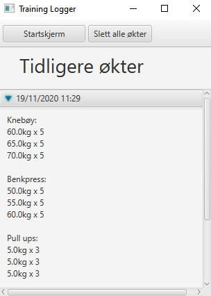

# Training Logger

Training Logger er en applikasjon som lar deg loggføre gjennomførte treninger i tillegg til å planlegge fremtidige treninger.

## Beskrivelse


### Grunnidè

**Merk:** Dette er idèen som motiverer til videre utvikling av applikasjonen og skal ikke nødvendigvis fullføres i løpet av dette prosjektet. 

Grunnidèen til applikasjonen er en applikasjon som kan brukes både før trening, under trening og etter trening; man skal kunne planlegge en økt, 
endre en økt og i ettertid bruke informasjonen til økten for å forbedre neste trening. Det langsiktige bildet av grunnidèen er som 
følger: 

I applikasjonen skal man komme til et vindu hvor man kan se tidligere økter. Her kan man utføre følgende handlinger:
- Man kan trykke på en økt. Da vil økten utvides og vise mer informasjon. Her vil man da se hva som ble gjort på økten,
og man kan velge å slette eller endre på økten om man ønsker det.
- Man kan velge å lage en ny økt. Her kan man velge hvilke øvelser man skal ta med, og man kan legge til så mange 
sett man vil. På hvert sett så kan man velge antall repetisjoner og vekt uavhengig av de andre settene. 

### Utvidelser fra grunnidèen
Applikasjonen skal etterhvert utvides med funksjonalitet som forbedrer planleggingen og gir brukeren
en detaljert oversikt over egen trening. Grunnidèen er i hovedsak beskrevet med en baktanke om styrketrening. Applikasjonen
skal utvides med funksjonalitet som støtter andre former for trening, slik som kondisjonstrening. 
Det er tenkt at applikasjonen skal inneholde følgende funksjoner: 
- Progresjonsmåler: Man skal som bruker kunne se en oversikt over egen progresjon. Denne oversikten vil vise
estimert maksløft basert på hva brukeren har gjort på trening. Denne estimeringen regnes enkelt ut ved hjelp av
en formel basert på hva som ble gjort og hvor mange ganger det ble gjort. I tillegg skal applikasjonen holde styr på
personlige rekorder. 
- Kommentarer tilknyttet hvordan brukeren opplevde økten som gjør analyse av lengre
treningsperioder mulig. Brukeren skal da kunne skrive en tekstkommentar og i tillegg velge hvor hard økten
opplevdes (hard, middels, enkel) hvis dette er ønskelig. 
- Mulighet for å loggføre andre typer økter enn styrketrening, slik som kondisjonstrening. Innenfor løping vil man blant 
annet kunne holde styr på rundetider, ukentlige kilometer, tempo og personlige rekorder. 

## Logisk struktur

### Pakkediagram med plantUML: 
Applikasjonen består av fem ulike moduler som er koblet sammen med hverandre og med andre biblioteker. Core-modulen inneholder alt som har
med kjernelogikk å gjøre, som i vårt tilfelle er håndtering av økter, øvelser og sett. fxui-modulen bruker denne logikken samt sin egen logikk 
for å vise et brukergrensesnitt med riktig funksjonalitet. Restserveren kommuniserer med kjerneklassene gjennom RESTapi-et for å håndtere 
lagring på en fjern lokasjon. Denne koblingen er illustrert i diagrammet under. 

```plantuml 

Title Pakkediagram

Skinparam Padding 15

component integrationTests-modul as IntModul{
  package webapp
}    

component "core-modul" as CoreModul {
    package core
    package json
}

component fxui-modul as FXModul {
  package ui
}

component restapi-modul as APIModul{
  package restapi
}

component restserver-modul as ServerModul {
    package restserver
  
}

package javafx
package fxml
package javax
package jersey

restserver ..> restapi
restserver ..> core
restapi ..> core
restapi ..> json
ui ..> core
ui ..> json

FXModul ...> javafx
FXModul ...> fxml
ServerModul ...> jersey 
ServerModul ...> javax
APIModul ...> javax

CoreModul -[hidden]down-- IntModul

```


### Klassediagram med plantUML: 
Applikasjonen benytter seg av samhandling mellom mange klasser i forskjellige moduler. I diagrammet under kan man se 
en oversikt over de viktigste klassene og hvordan disse klassene henger sammen med hverandre. Man kan se et hierarki av 
kjerneklassene, samt hvordan disse er koblet opp mot serialisererne. I tillegg kan man se et hierarki av kontrollere 
som brukes blant annet for å kunne bytte skjerm på en god måte.

```plantuml


Title Klassediagram

Package Core-modul {

class Session {
    - final DateTimeFormatter dateTimeFormatter 
    - final List<Exercise> exercises
    - String description 
    - LocalDateTime date
    
    + Session(String d, Exercise... e) 
    + void AddExercises(Exercise... e)
    + Iterator<Exercise> iterator()
}

class Exercise {
    - final List<Set> sets 
    - String name
    
    + Exercise(String name, Set... sets)
    + void AddSets(Set... sets)
    + Iterator<Set> iterator()
}

class Set {
    - final int repetitions
    - final double weight 
    
    + Set(int r, double w)
}

class SessionLogger {
    - final List<Session> sessions 
    - final Map<String, Double> records 
    
    + SessionLogger(List<Session> s, Map<String, Double> r)
    + void updateRecordWithSession(Session session)
    + void delateRecords() 
    + Iterator<Session> iterator()
    + void delateAll()
}

class TrainingLoggerModule {
    -static final String name
    +TrainingLoggerModule()
}
note left
    Merk: serialize- og deserializeklassene sine metoder
    tar inn flere argumenter som ikke er skrevet opp
    for ryddigheten i diagrammet sin skyld
end note

class SesssionLoggerSerializer {
    +void serialize()
}
class SessionSerializer {
    +void serialize()
}
class ExerciseSerializer {
    +void serialize()
}
class SetSerializer {
    +void serialize()
}
class SesssionLoggerDeserializer {
    + SessionLogger deserialize()
}
class SessionDeserializer {
    + Session deserialize()
}
class ExerciseDeserializer {
    + Exercise deserialize()
}
class SetDeserializer {
    + Set deserialize()
}
class TrainingLoggerPersistence 

TrainingLoggerModule --> SesssionLoggerSerializer
TrainingLoggerModule --> SessionSerializer
TrainingLoggerModule --> ExerciseSerializer
TrainingLoggerModule --> SetSerializer
TrainingLoggerModule --> SesssionLoggerDeserializer
TrainingLoggerModule --> SessionDeserializer
TrainingLoggerModule --> ExerciseDeserializer
TrainingLoggerModule --> SetDeserializer

SessionLogger -> "*" Session
SessionLogger .. TrainingLoggerModule
TrainingLoggerModule -> TrainingLoggerPersistence
Session -> "*" Exercise
Exercise -> "*" Set
}

Package fxui-modul {

Class App {

    + void start()
}
Class AppController
Class DirectTrainingLoggerAccess {
    void addSession(session Session)
    void deleteAll()
    SessionLogger getSessionLogger()
    - void saveSessionLogger()
}
Class HBoxTemplateController
Class SessionScreenController
Class StartScreenController
Class RecordScreenController
Class NewSessionScreenController {
    - Session session
}
Class NewExerciseScreenController {
    - Exercise exercise
}
Class RemoteTrainingLoggerAccess {
    void addSession(session Session)
    void deleteAll()
    SessionLogger getSessionLogger()
}
Class RemoteApp {
    
    + void start()
}
Interface TrainingLoggerAccess {
    void addSession(session Session)
    void deleteAll()
    SessionLogger getSessionLogger()
}
Class TrainingLoggerController {
    
    + void changeToStartScreen
    + void changeToNewSessionScreen
    + void changeToSessionScreen
    + void changeToNewExerciseScreen
    + void changeToRecordScreen
}

App --> AppController
RemoteApp --> AppController

AppController --> TrainingLoggerController

TrainingLoggerController <-- StartScreenController
TrainingLoggerController <--> NewSessionScreenController
NewExerciseScreenController -left-> NewSessionScreenController
TrainingLoggerController <-- NewExerciseScreenController
TrainingLoggerController <--> SessionScreenController
TrainingLoggerController <--> RecordScreenController
TrainingLoggerController ---> TrainingLoggerAccess
TrainingLoggerAccess ..|> RemoteTrainingLoggerAccess
TrainingLoggerAccess ..|> DirectTrainingLoggerAccess
NewExerciseScreenController --> HBoxTemplateController
}

SetSerializer -[hidden]down- RemoteApp

```

### Sekvensdiagram med PlantUML
Under kan man se et sekvensdiagram av en bestemt interaksjon med applikasjonen. Interaksjonen er som følger: 

> Brukeren er inne på skjermen for å legge til en øvelse til en tom økt. Brukeren skriver inn "Benkpress" som navn på 
øvelsen og legger inn ett sett på 60kg med 5 repetisjoner. Deretter trykker brukeren på "legg til øvelse" og så på "legg til økten".

Diagrammet viser interaksjonen mellom de forskjellige klassene etterhvert som de to knappene trykkes på: 

```plantuml

Title Sekvensdiagram

skinparam sequenceArrowThickness 2
skinparam roundcorner 20
skinparam maxmessagesize 60
skinparam sequenceParticipant underline

actor Bruker
participant "NewExerciseScreenController" as NewExerciseScreenController
participant "TrainingLoggerController" as TrainingLoggerController
participant "NewSessionScreenController" as NewSessionScreenController
participant "NewSessionScreenController" as NewSessionScreenController
participant "Exercise1" as exercise1
participant "Exercise2" as exercise2
participant "Session1" as session1
participant "Session2" as session2
participant "RemoteTrainingLoggerAccess" as RemoteAccess
participant "RESTserver" as server

activate TrainingLoggerController
activate NewExerciseScreenController
activate exercise1
activate NewSessionScreenController
activate session1

Bruker -> NewExerciseScreenController: Trykker på "Legg til øvelse"

NewExerciseScreenController -> exercise1: setName(getText())

NewExerciseScreenController -> NewSessionScreenController: addExerciseToSession(exercise)

NewSessionScreenController -> session1: addExercises(Exercise1)

NewExerciseScreenController -> exercise2: new Exercise()
deactivate exercise1
activate exercise2

NewExerciseScreenController -> NewExerciseScreenController: resetInputFields()

NewExerciseScreenController -> TrainingLoggerController: changeToNewSessionScreen()

TrainingLoggerController -> NewSessionScreenController: updateExerciseOverview()

TrainingLoggerController -> TrainingLoggerController: getChildren().clear()
deactivate NewExerciseScreenController

TrainingLoggerController -> TrainingLoggerController: getChildren().add(this.newSessionScreen)

TrainingLoggerController -> Bruker: Viser skjerm for ny økt

Bruker -> NewSessionScreenController: trykker på "Legg til økten"

NewSessionScreenController -> session1: setDescription()

NewSessionScreenController -> TrainingLoggerController: addSessionToSessionLogger(Session1)

TrainingLoggerController -> RemoteAccess: addSession(Session1)

RemoteAccess -> server: PUT, Session1

server -> RemoteAccess: True

NewSessionScreenController -> session2: new Session()
activate session2
deactivate session1

NewSessionScreenController -> NewSessionScreenController: resetScreen()

NewSessionScreenController -> TrainingLoggerController: changeToStartScreen()

TrainingLoggerController -> TrainingLoggerController: mainVbox.getChildren().clear()
deactivate NewSessionScreenController
TrainingLoggerController -> TrainingLoggerController: mainVbox.getChildren().add(this.startScreen)

TrainingLoggerController -> Bruker: Viser startskjerm

```


## Utseende av applikasjonen ved prosjektslutt
Utseendet til applikasjonen kan sees fra skjermbildene under:

**Startskjerm og rekorder:**  


**Tidligere økter:**  



**Ny økt og ny øvelse**  


## Tenkt utseende til sluttprodukt

Det tenkes at sluttproduktet skal ha en startskjerm med brukerinnlogging. Her skal man kunne skrive inn 
brukernavn og passord, og trykke på en "logg inn"-knapp. Etter dette vil brukeren komme til en oversiktsskjerm
med en liste med knapper. Disse knappene skal forflytte brukeren inn på riktig skjerm avhengig av valget til brukeren.
Her skal brukeren kunne velge mellom tidligere økter, progresjon og en oversikt over personlige rekorder. Dersom
brukeren trykker seg inn for å se tidlgiere økter, så vil denne skjermen se tilsvarende ut til den vi har laget
til gruppeinnlevering 1. 

